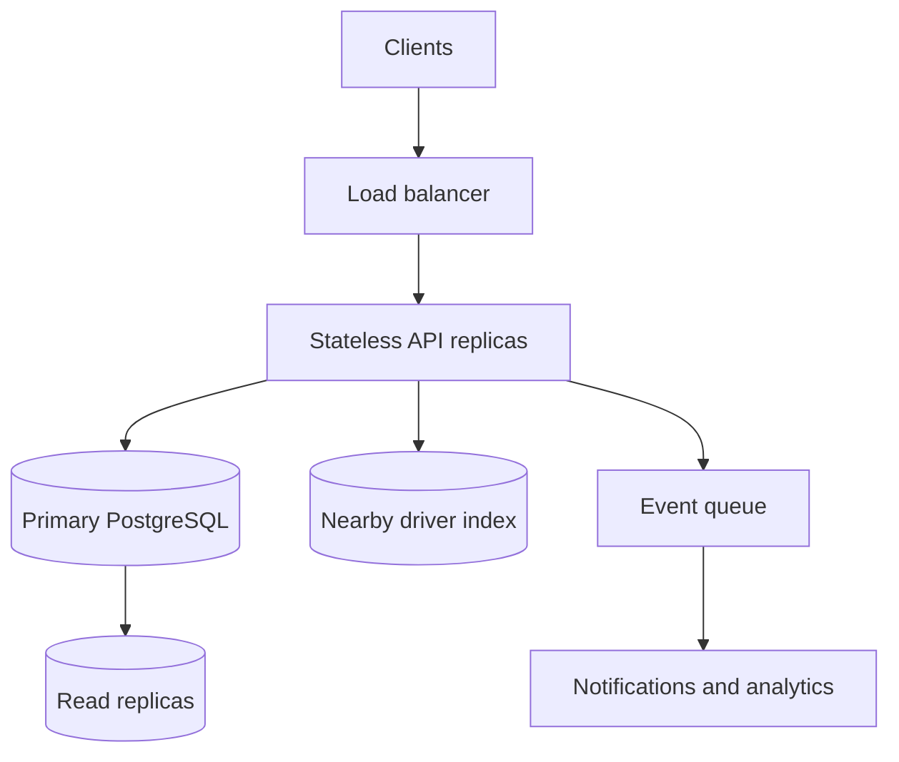

# If Oi Tesla Goes Viral

The MVP's transaction boundary stays the source of truth for seat inventory. At one million passengers and 100,000 drivers, search and live updates can scale independently, while a committed seat still comes from the primary database.

- **Matching:** Partition candidate discovery by city/area and use a geospatial index for nearby drivers. A cached candidate list is advisory; an atomic database claim still decides the seat. Avoid a single global lock by assigning each active vehicle/pool to one contention key.
- **Database:** Index active requests by pickup/created time and active pools by route group. Archive old ride events. Read replicas serve history, while all booking and status writes remain on the primary. Monitor lock wait time and pool hot spots.
- **API and live state:** Run stateless replicas behind a load balancer. Replace six-second polling with authenticated WebSockets or server-sent events; reconnecting clients fetch current state from the API rather than trusting a missed event.
- **Queues:** Send notifications and analytics after the transaction commits via an outbox table. Consumers retry with idempotency keys; a failed notification does not roll back the ride. Payment providers, if added, require their own idempotency and reconciliation.
- **Retries and failure:** Use client request keys to prevent duplicate bookings. Set transaction timeouts and retry only safe serialization failures with jitter. A failed claim leaves the request waiting; never report a seat before the commit succeeds.
- **Operations:** Add request tracing, structured logs, metrics for match latency and overbooking attempts, alerts for database lag, rate limiting at the edge, secret management, TLS, backups, and staged migrations. Use rolling deploys and feature flags to keep old and new clients compatible.

These are staged changes, not extra services in the internship MVP. Capacity integrity stays in the database as traffic grows.
